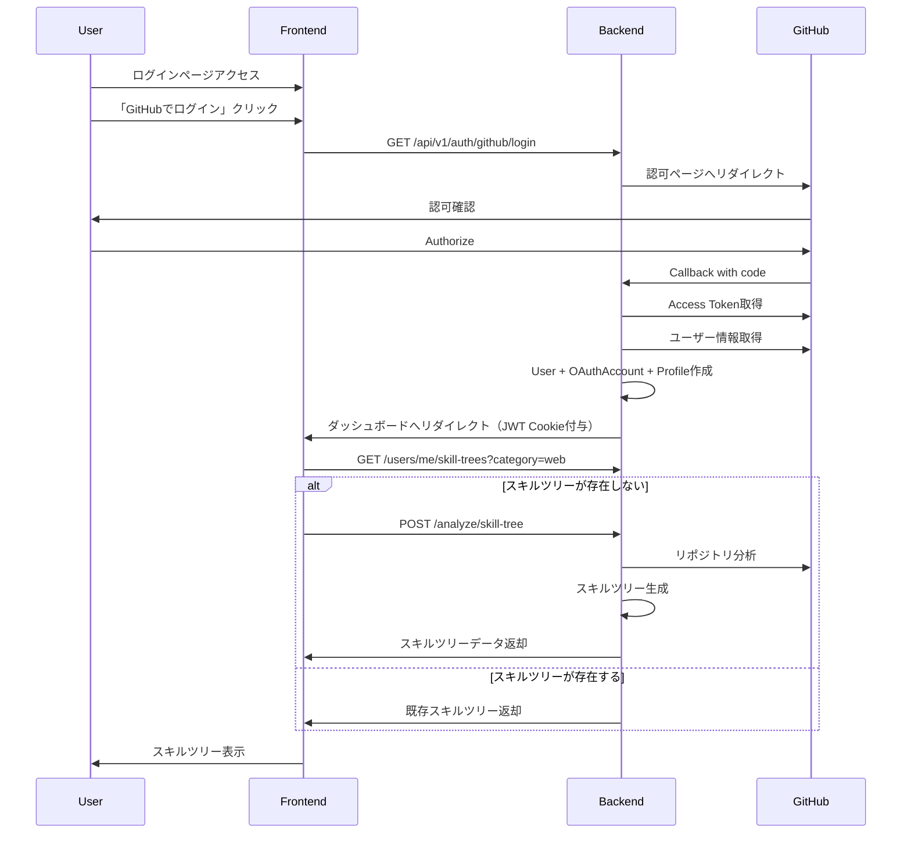

# Issue #71: GitHub OAuth認証とスキルツリー生成の統合

## 実装概要

GitHub OAuthを使った認証機能を実装し、認証後にユーザーのGitHubリポジトリを分析してパーソナライズされたスキルツリーを自動生成する機能を統合しました。

## 実装内容

### 1. ログイン画面の改善 (`frontend/src/app/login/page.tsx`)

- **デザイン改善**:
  - グラデーション背景の追加
  - アイコン追加（🌳）
  - アニメーション効果（スライドアップ、シェイク、スライドダウン）
  - GitHubログインボタンの視覚効果強化（シャインエフェクト）
  - ローディング状態の改善（スピナー表示）
- **UI/UX改善**:
  - テストユーザー情報を折りたたみ可能に変更
  - エラーメッセージのスタイル改善
  - ボタンのホバー/アクティブ状態のアニメーション

### 2. OAuth callback時のProfile自動作成 (`backend/app/api/endpoints/auth.py`)

- **新規ユーザー登録時**:
  - User、OAuthAccount、Profileを同一トランザクションで作成
  - GitHubのログイン名を `github_username` として自動設定
  - アトミック性を保証（一部だけが保存されるゾンビレコードを防止）

- **既存ユーザーログイン時**:
  - Profileが存在しない場合は自動作成（マイグレーション対策）
  - 失敗してもログインは継続（Warningログのみ）

### 3. Profile CRUD操作の改善 (`backend/app/crud/profile.py`)

- `create_profile()` に `commit` パラメータを追加
- `commit=False` の場合は `flush()` のみ実行（トランザクション制御用）

### 4. スキルツリーAPIエンドポイントの改善 (`backend/app/api/endpoints/users.py`)

- `/users/me/skill-trees` エンドポイントに `category` クエリパラメータを追加
- カテゴリでフィルタリング可能に
- 未指定の場合は全カテゴリを返却（後方互換性維持）

## 動作フロー



## セットアップ手順

### 1. GitHub OAuth Appの作成

詳細は [docs/GITHUB_OAUTH_SETUP.md](../docs/GITHUB_OAUTH_SETUP.md) を参照してください。

**簡易手順**:

1. [GitHub Developer Settings](https://github.com/settings/developers) にアクセス
2. 「New OAuth App」をクリック
3. 以下を設定:
   - Homepage URL: `http://localhost:3000`
   - Authorization callback URL: `http://localhost:8000/api/v1/auth/github/callback`
4. Client IDとClient Secretを取得

### 2. 環境変数の設定

`backend/.env` ファイルに以下を設定:

```dotenv
# GitHub OAuth
GITHUB_CLIENT_ID=<取得したClient ID>
GITHUB_CLIENT_SECRET=<取得したClient Secret>

# JWT設定（必須）
JWT_SECRET_KEY=<ランダムな文字列>

# 暗号化キー（必須）
ENCRYPTION_KEY=<Fernetキー>

# GitHub API Token（オプション、Rate Limit緩和）
GITHUB_API_TOKEN=<Personal Access Token>
```

**キー生成方法**:

```bash
# JWT Secret Key
python -c "import secrets; print(secrets.token_hex(32))"

# Encryption Key
python -c "from cryptography.fernet import Fernet; print(Fernet.generate_key().decode())"
```

### 3. 起動

```bash
# バックエンド
cd backend
poetry install
poetry run uvicorn app.main:app --reload

# フロントエンド（別ターミナル）
cd frontend
npm install
npm run dev
```

### 4. 動作確認

1. `http://localhost:3000/login` にアクセス
2. 「🚀 GitHub でログイン（推奨）」ボタンをクリック
3. GitHubの認可ページで「Authorize」をクリック
4. ダッシュボードにリダイレクトされ、スキルツリーが表示される

## セキュリティ対策

### 実装済みの対策

1. **CSRF対策** (ADR 014):
   - HMAC署名付きstateパラメータ
   - Cookie バインディング検証

2. **XSS対策**:
   - httpOnly Cookie（JavaScriptからアクセス不可）
   - JWT を URL パラメータに含めない

3. **トークン暗号化** (ADR 005):
   - OAuthアクセストークンはFernetで暗号化してDB保存
   - `ENCRYPTION_KEY` が未設定の場合は起動時にエラー

4. **最小権限の原則**:
   - GitHub OAuth スコープは `read:user` のみ要求

5. **入力検証**:
   - username: 1〜72文字制限（ADR 017）
   - password: 1〜128文字制限（PBKDF2 DoS対策）

## テスト

```bash
cd backend
poetry run pytest tests/test_api/test_auth.py -v
poetry run pytest tests/test_services/test_skill_tree_service.py -v
```

## トラブルシューティング

### エラー: "GitHub OAuth は設定されていません"

→ `.env` の `GITHUB_CLIENT_ID` と `GITHUB_CLIENT_SECRET` を確認し、バックエンドを再起動

### エラー: "Invalid or expired state parameter"

→ GitHub OAuth Appの `Authorization callback URL` が正しいか確認

### スキルツリーが表示されない

→ ブラウザの開発者ツールでネットワークタブを確認:

- `/users/me/skill-trees` が 200 を返しているか？
- 404の場合: Profileが作成されていない可能性（DBを確認）
- 500の場合: バックエンドログを確認

## 関連Issue

- Issue #71: GitHub OAuth認証とスキルツリー生成の統合
- Issue #59: GitHub OAuth認証の実装
- Issue #61: 認証統合（Cookie ベース）
- Issue #54: スキルツリー生成（LLM実装）

## ADR参照

- ADR 014: JWT Cookie ベース認証
- ADR 005: OAuthトークンの暗号化保存
- ADR 017: 入力バリデーション戦略
